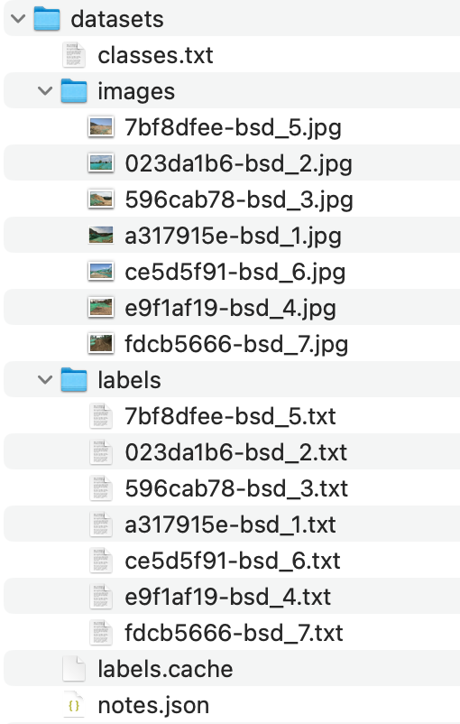
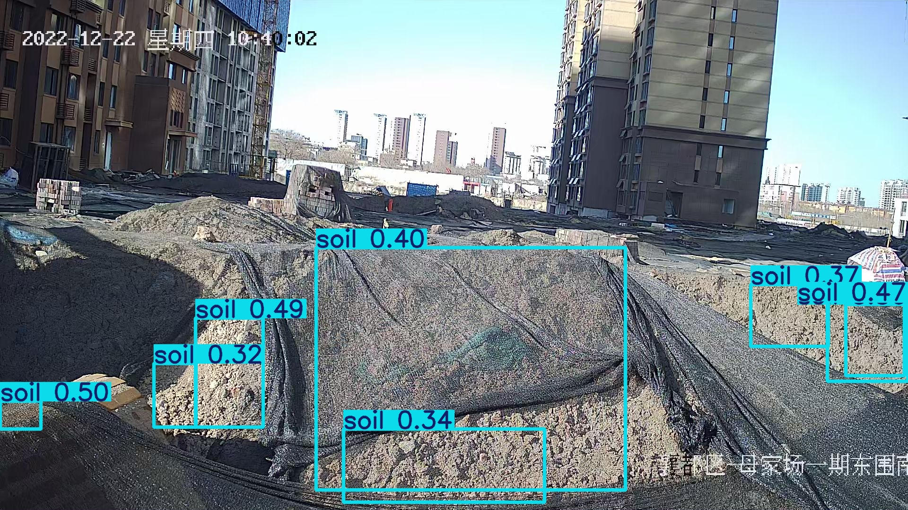
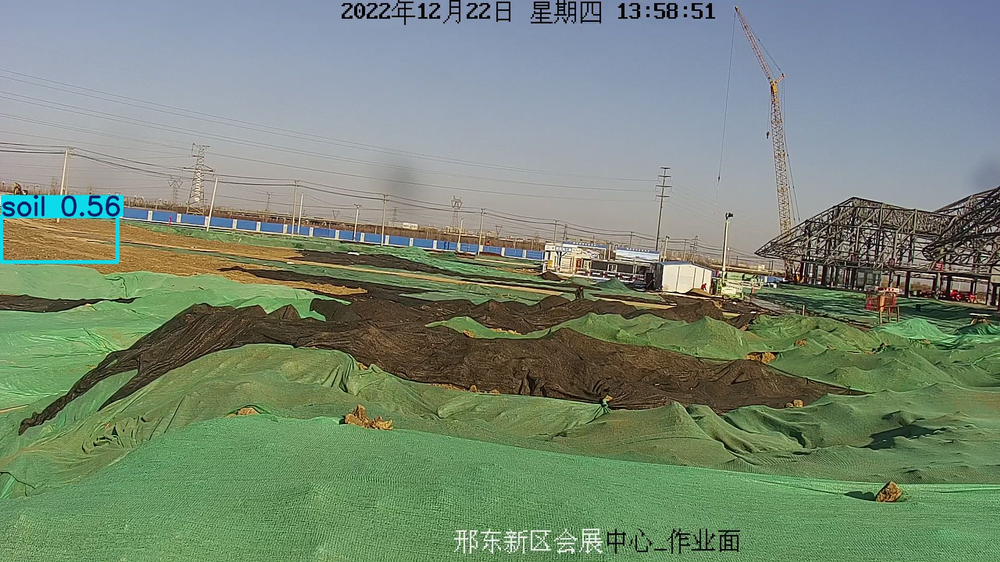
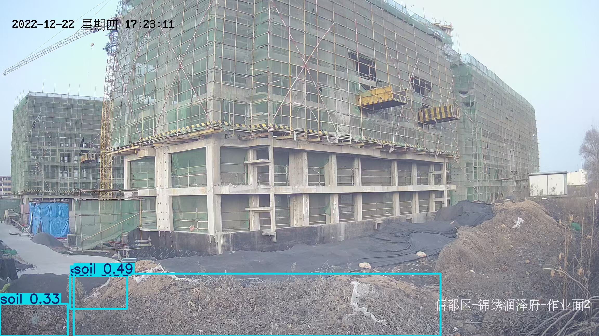

# Bare Soil Detector (建筑工地裸土识别)

训练了一个基于 Yolo11m 模型的裸土检测模型，基于 310 张工地监控摄像头截图标注，epoch 为 100，效果一般，但可以满足基本需求。

**注意：训练的数据集没有标注 cover (覆盖篷布)，所以自带模型不能识别出篷布，只能识别裸土，但是数据集如果标注好 cover 就可以直接训练识别了**

## Requirements 依赖

- Python 3.x
- Ultralytics YOLO: `pip install ultralytics`
- （可选）支持 CUDA 的 GPU 或 Apple Silicon 以加速训练/推理。

## Setup 设置

1.  **Clone the repository:**
    **克隆仓库:**

    ```bash
    git clone git@github.com:bochili/bare-soil-detector.git
    cd bare-soil-detector
    ```

2.  **Install dependencies:**
    **安装依赖:**

    ```bash
    pip install ultralytics
    ```

3.  **(Optional) Prepare your dataset:**
    **(可选) 准备你的数据集:**
    - 按照 YOLO 格式组织你的图片和标签。
    - 更新 `soil.yaml` 中的 `train:` 和 `val:` 路径，使其指向你的数据集图片目录。**重要提示：** 使用相对路径或确保绝对路径在你的环境中是正确的。
    - 确认 `soil.yaml` 中的类别名称与你的数据集一致。

## Usage 使用

### Training 训练

- 修改 `soil.yaml` 指向你的数据集（如果不使用示例路径）。
- 运行训练脚本。根据需要调整 `epochs` 和 `device`。

  ```bash
  python train.py
  ```

- 训练好的模型 (`best.pt`) 和结果默认会保存在 `runs/detect/train*` 目录（或类似目录，取决于 YOLO 版本）。

### Detection 检测

**方法一：使用 `test.py`（检测文件夹中所有图片）**

- 将你的图片放入 `test_imgs/` 文件夹（或修改 `test.py` 中的路径）。
- 确保 `test.py` 中的模型路径 (`train_result/weights/best.pt`) 正确。
- 运行脚本。结果将保存在 `runs/detect/predict*` 目录。

  ```bash
  python test.py
  ```

**Method 2: Using `SoilDetector` class**
**方法二：使用 `SoilDetector` 类**

- See the example usage at the bottom of `soil_detector.py`.
  参考 `soil_detector.py` 文件底部的示例用法。
- You can integrate the `SoilDetector` class into your own applications.
  你可以将 `SoilDetector` 类集成到你自己的应用程序中。

  ```python
  from soil_detector import SoilDetector

  # Initialize detector (adjust model path and output dir if needed)
  # 初始化检测器（如果需要，调整模型路径和输出目录）
  detector = SoilDetector(model_path="train_result/weights/best.pt", conf_threshold=0.3, output_dir="output")

  # List of image paths to detect
  # 需要检测的图片路径列表
  image_paths = ["test_imgs/1.jpg", "test_imgs/another_image.png"]

  # Perform detection
  # 执行检测
  detection_results = detector.detect(image_paths)

  # Process results
  # 处理结果
  for result in detection_results:
      print(f"Image: {result['image_path']}")
      if result["has_soil"]:
          print(f"  Detected bare soil with confidence: {result['soil_confidence']:.2f}")
      else:
          print("  No bare soil detected.")
      print(f"  Result saved to: {result['result_path']}")
      print("-" * 20)

  ```

- 结果（图片和检测信息）将保存在指定的 `output_dir`（默认：`output/`）中。

## Dataset 数据集

数据集配置在 `soil.yaml` 中定义。它期望在指定的 `train` 和 `val` 目录中有图片，并附带相应的 YOLO 格式标签文件 (`.txt`)。

Classes / 类别:

- `cover`: Covered areas (e.g., with nets, tarps) / 覆盖区域（例如，有网、篷布）
- `soil`: Bare soil / 裸露土壤

组织结构：标准的 YOLO 格式



## Example Results 识别示例






